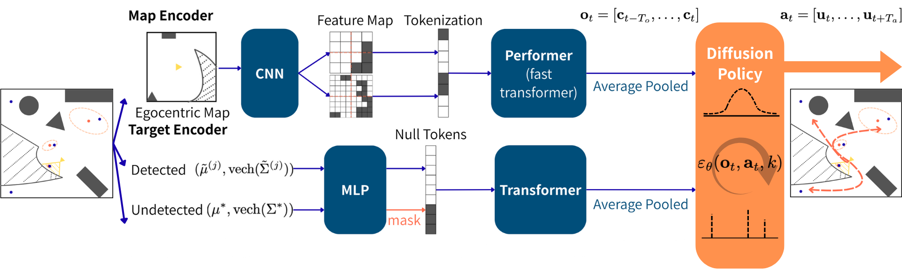
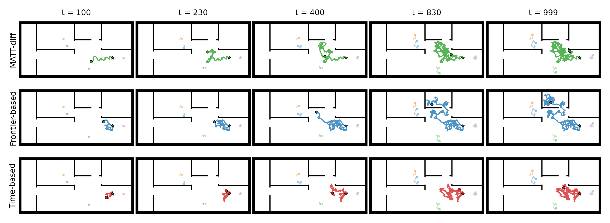

# Active Multi-Agent tracking

Please check our [code](https://github.com/CINAPSLab/MATT-Diff.git) in CINAPSLab GitHub Organization.
This repository is a PyTorch implementation for paper ***[MATT--Diff: Multimodal Active Target Tracking by Diffusion Policy](https://arxiv.org/pdf/2511.11931)***
Authors: [Saida Liu](https://saidaliu27.github.io/), [Nikolay Atanasov](https://natanaso.github.io/), [Shumon Koga](https://shumon0423.github.io/).
If you are using the code for research work, please cite:


```
@misc{liu2025mattdiffmultimodalactivetarget,
      title={MATT-Diff: Multimodal Active Target Tracking by Diffusion Policy}, 
      author={Saida Liu and Nikolay Atanasov and Shumon Koga},
      year={2025},
      eprint={2511.11931},
      archivePrefix={arXiv},
      primaryClass={cs.RO},
      url={https://arxiv.org/abs/2511.11931}, 
}

```

## Diffusion Policy Network

<div style="display:flex; justify-content:center;">
  
</div>


## Overview

MATT-Diff is a diffusion-policy-based framework for **active multi-target tracking**
in partially observable indoor environments. It learns multi-modal action strategies
from three expert planners, using a preformer
map encoder and attention-based target encoder over Gaussian beliefs.


## Keywords
Diffusion policy, Active Target Tracking, Reinforcement Learning


## Experimental Results

<div style="display:flex; justify-content:center;">
  
</div>

## Environment / Setup

This repository is designed to run inside a VS Code **Dev Container**.

We provide:

- `.devcontainer/devcontainer.json` — VS Code Remote Container configuration  
- `Dockerfile` — CUDA + Python + PyTorch + dependencies

### Requirements

- Docker (with NVIDIA Container Toolkit)
- NVIDIA GPU with CUDA 12 support (tested with CUDA 12.8 runtime)
- VS Code + "Dev Containers" / "Remote - Containers" extension

### Recommended setup (Dev Container)

1. Clone the repository:

   ```bash
   git clone https://github.com/CINAPSLab/MATT-Diff.git
   cd MATT-Diff
   ```

2. Open this folder in VS Code and click:

   **“Reopen in Container”**

3. The dev container will automatically:

   - Build from the provided Dockerfile (CUDA 12.8 / Ubuntu 22.04)  
   - Create a virtual environment at `/opt/venv`  
   - Install nightly PyTorch with CUDA 12.8 + all dependencies from `requirements.txt`  
   - Set environment variables such as `PYTHONPATH=/workspace:/workspace/src`

## Run and Test

We provide pretrained checkpoints via HuggingFace.
Training from scratch requires the expert dataset, which is not included in this repository.

### Download commands

```bash
huggingface-cli download saidaliu27/MATT-Diff dp/best.pt --local-dir src/run/dp
huggingface-cli download saidaliu27/MATT-Diff bc/best.pt --local-dir src/run/bc
```

### Download via curl

```bash
curl -L https://huggingface.co/saidaliu27/MATT-Diff/resolve/main/dp/best.pt -o src/run/dp/best.pt
curl -L https://huggingface.co/saidaliu27/MATT-Diff/resolve/main/bc/best.pt -o src/run/bc/best.pt
```

After downloading, you can directly evaluate MATT-Diff

### Evaluate MATT-Diff

```bash
python -u -m evals.eval_dp
```

## Other codes usages

### Collect train Dataset

```bash
python -u -m logger.explore_logger # collect data of Frontier-based planner
python -u -m logger.mm_logger # collect data of Time-based, Uncertainty-based planner
python -u -m logger.refinedata # refine collected expert data
python -u -m src.train_dp # train MATT-diff
```
